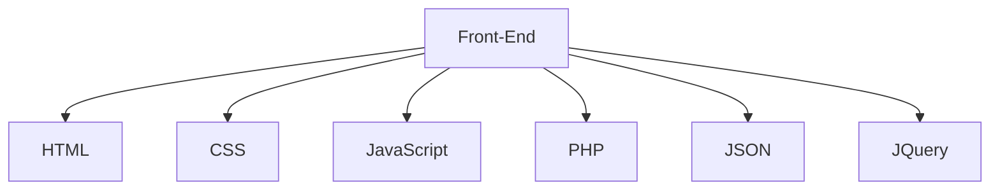

<h1 align="center">Hi 👋, I'm Alexander Dheins</h1>

<h3 align="center">A passionate frontend developer from Perú</h3>

👨‍💻 All of my projects are available at [https://lexpy.dev]
  

  
   
  
  

 

 
   
    
      
  
  
   
     
   
   
   
   

