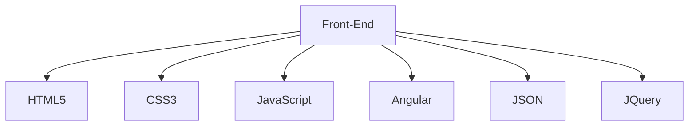

!)

<h1 align="center">Hi 👋, I'm Alexander Dheins</h1>
<h3 align="center">A passionate frontend developer from Perú</h3>

- 👨‍💻 All of my projects are available at [https://lexpy.dev]
   
- 📫 How to reach me **soporte.ti@lexpy.dev**
  

  
   
  
  

 

 

 
   
    
      
  
  
  
   
   
   
   
   
   
   
   

